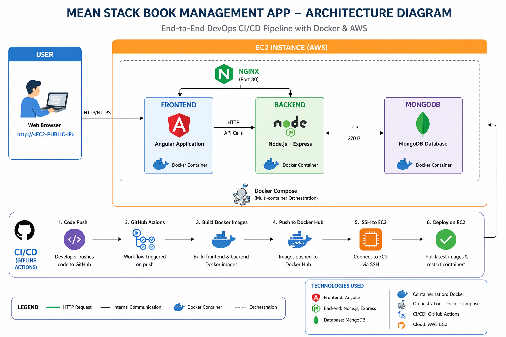

# 📚 MEAN Stack Book Management App (DevOps Project)

## 🚀 Project Overview

This project is a full-stack **MEAN (MongoDB, Express, Angular, Node.js)** application that allows users to manage books (add, view, delete).

The application is fully containerized using Docker and deployed on AWS EC2 with an automated CI/CD pipeline using GitHub Actions.


---

## ⚙️ Features

* 📖 View all books
* ➕ Add new books
* ❌ Delete books
* 🔍 Search functionality
* 🌐 Fully deployed on cloud

---

## 🏗️ Architecture

* **Frontend:** Angular (served via Nginx)
* **Backend:** Node.js + Express
* **Database:** MongoDB
* **Containerization:** Docker & Docker Compose
* **CI/CD:** GitHub Actions
* **Deployment:** AWS EC2




## ⚙️ Configuration Changes (Local vs AWS Deployment)

This project requires updating certain configurations based on the environment (Local vs AWS EC2).
Below are the key files and values that need to be modified.

---

### 🌐 1. Frontend API URL

📁 **File:**

```bash
frontend/src/app/services/tutorial.service.ts
```

#### 🔧 Change API endpoint:

```js
// ❌ Local (default)
http://localhost:8080/api/tutorials

// ✅ AWS Deployment
http://<EC2-PUBLIC-IP>:5000/api/tutorials
```

👉 Example:

```js
http://44.249.183.56:5000/api/tutorials
```

---

### 🗄️ 2. Backend Database Connection

📁 **File:**

```bash
backend/app/config/db.config.js
```

#### 🔧 Update MongoDB connection:

```js
// ❌ Local (outside Docker)
mongodb://localhost:27017/testdb

// ✅ Docker / AWS
mongodb://mongodb:27017/testdb
```

👉 `mongodb` refers to the **Docker service name** defined in `docker-compose.yml`.

---

## 🔌 Port Configuration

The application uses the following ports:

---

### 🎨 Frontend (Angular + Nginx)

| File                  | Configuration |
| --------------------- | ------------- |
| `frontend/Dockerfile` | `EXPOSE 80`   |
| `docker-compose.yml`  | `"80:80"`     |

👉 Access UI:

```text
http://<EC2-PUBLIC-IP>
```

---

### ⚙️ Backend (Node.js)

| File                 | Configuration |
| -------------------- | ------------- |
| `backend/server.js`  | `PORT = 5000` |
| `backend/Dockerfile` | `EXPOSE 5000` |
| `docker-compose.yml` | `"5000:5000"` |

👉 API endpoint:

```text
http://<EC2-PUBLIC-IP>:5000/api/tutorials
```

---

### 🗄️ MongoDB

| File                 | Configuration                    |
| -------------------- | -------------------------------- |
| `docker-compose.yml` | `"27017:27017"`                  |
| `db.config.js`       | `mongodb://mongodb:27017/testdb` |

---

## 🔁 Summary of Changes

| Component        | Local Setup      | AWS Deployment  |
| ---------------- | ---------------- | --------------- |
| Frontend API URL | `localhost:8080` | `<EC2-IP>:5000` |
| MongoDB URL      | `localhost`      | `mongodb`       |
| Frontend Port    | 80               | 80              |
| Backend Port     | 5000             | 5000            |
| MongoDB Port     | 27017            | 27017           |

---

## 🚨 Important Notes

* ❌ Do NOT use `localhost` inside Docker containers
* ✅ Use **service names** (e.g., `mongodb`) for container communication
* 🌐 Use **EC2 Public IP** for browser/API access
* 🔒 Consider using **Elastic IP** to avoid IP changes

---

## 🚀 Best Practice (Recommended Improvement)

Instead of hardcoding IPs in frontend:

```js
/api/tutorials
```

👉 Use **Nginx reverse proxy** to avoid:

* Hardcoded IPs
* Port exposure
* CORS issues

---


## 🐳 Docker Setup

### 1️⃣ Clone the repository

```bash
git clone https://github.com/Navaneethasita/MEAN-STACK.git
cd MEAN-STACK
```

### 2️⃣ Run using Docker Compose

```bash
docker-compose up --build
```

### 3️⃣ Access application

* Frontend: http://localhost
* Backend API: http://localhost:5000/api/tutorials

---

## ☁️ Deployment (AWS EC2)

* Application deployed on EC2 instance
* Containers managed using Docker Compose
* Public access via:

```
http://<your-ec2-public-ip>
```

---

## 🔄 CI/CD Pipeline (GitHub Actions)

Pipeline automates:

1. Build Docker images
2. Push images to Docker Hub
3. SSH into EC2
4. Deploy updated containers

---

## 🔐 GitHub Secrets Used

* `DOCKER_USERNAME`
* `DOCKER_PASSWORD`
* `EC2_HOST`
* `EC2_KEY`

---

## 🧪 Testing

* API tested using browser & curl
* UI tested via browser
* End-to-end flow validated

---

## 🛠️ Tech Stack

* Angular
* Node.js
* Express.js
* MongoDB
* Docker
* GitHub Actions
* AWS EC2

---

## 👩‍💻 Author

**Navaneetha Sita**

---

## 🌟 Future Enhancements

* Add authentication (JWT)
* Use Nginx reverse proxy
* Add domain & HTTPS
* Deploy using Kubernetes

---

## 📌 Conclusion

This project demonstrates real-world DevOps practices including containerization, CI/CD automation, and cloud deployment.

---
